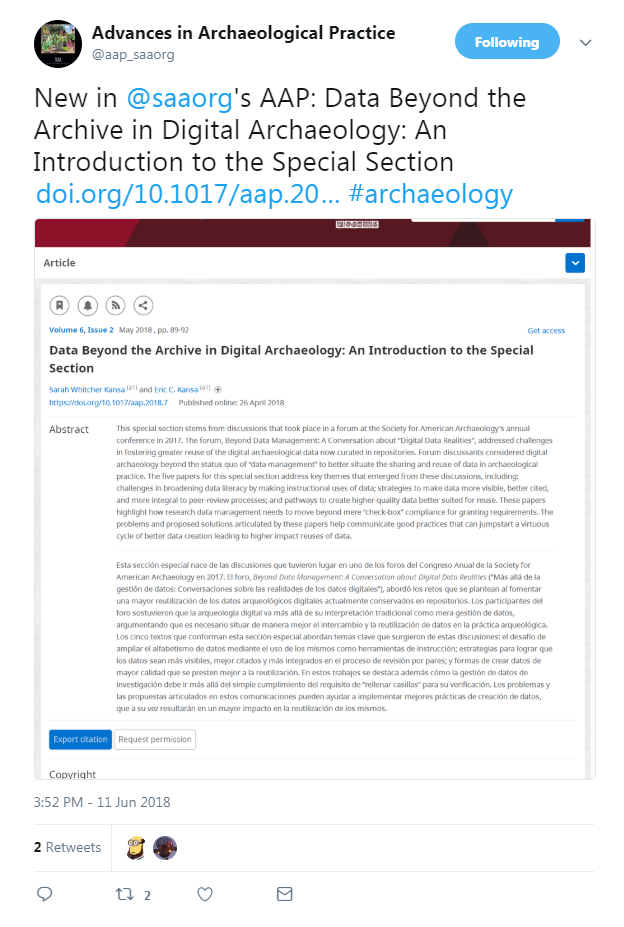

# _Advances in Archaeological Practice_ Tweets

The goal of this repository is to make it easy to compose and post tweets to advertise new articles published in the [SAA's](http://www.saa.org/) journal [_Advances in Archaeological Practice_](https://www.cambridge.org/core/journals/advances-in-archaeological-practice). 

We have taken the [code that Auriel Fournier uses](https://github.com/aurielfournier/wilson_ornithological_society_tweets) to post tweets for the Wilson Ornithological Society and made some minor variations for _Advances in Archaeological Practice_. The main innovation here is automatically capturing a screenshot of the title and abstract page adding that to the tweet. This helps to deliver a little bit more information about the article to twitter followers.

The AAP twitter page is at <https://twitter.com/aap_saaorg>. Here is the first tweet that this code posted:

