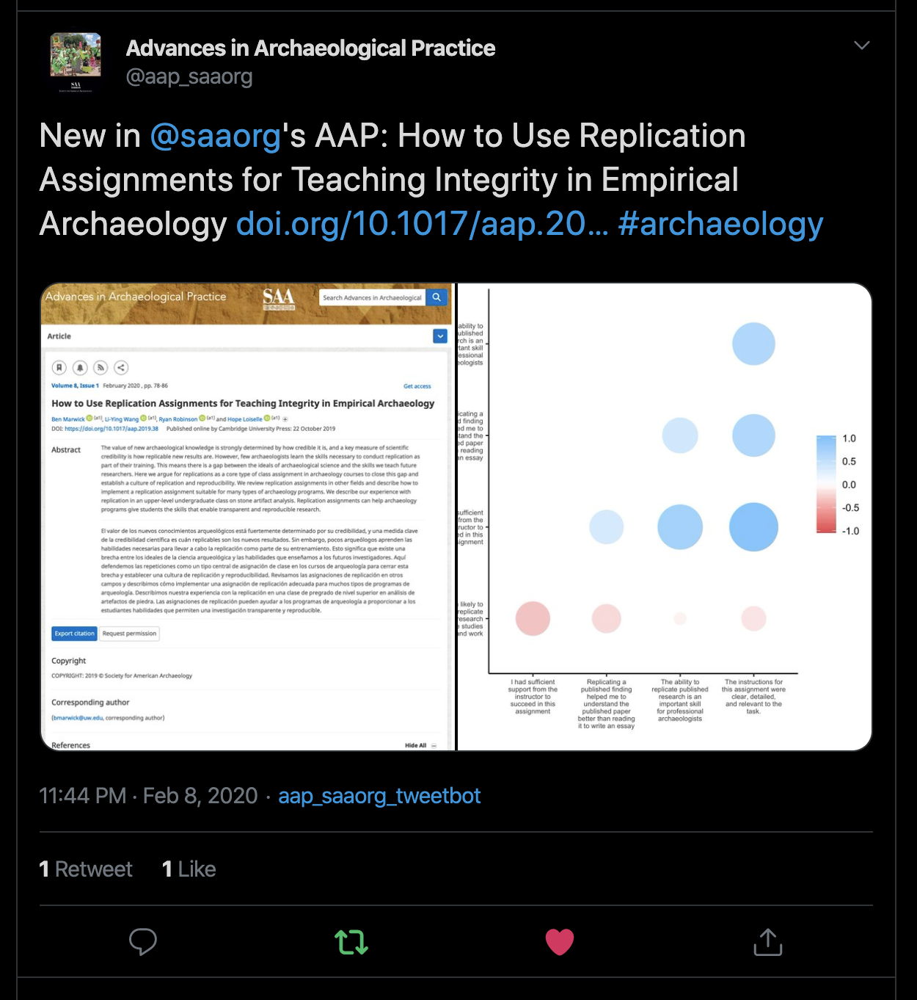

# _Advances in Archaeological Practice_ Tweets

The goal of this repository is to make it easy to compose and post tweets to advertise new articles published in the [SAA's](http://www.saa.org/) journal [_Advances in Archaeological Practice_](https://www.cambridge.org/core/journals/advances-in-archaeological-practice). 

We have started with [code that Auriel Fournier uses](https://github.com/aurielfournier/wilson_ornithological_society_tweets) to post tweets for the Wilson Ornithological Society and made some extensions to share articles from _Advances in Archaeological Practice_. 

The R code in this repo will:

- look at the list of articles on the AAP ['latest issue' page](https://www.cambridge.org/core/journals/advances-in-archaeological-practice/latest-issue) and grab the title, DOI, and screenshot of the abstract of each article
- look into folders on a [private Google Drive folder](https://drive.google.com/drive/u/1/folders/1ChWXaeK5_dMN6YoH6ocWf6dNA6-xd_2K) where the editor has deposited some images from each article
- convert those images from jpeg/pdf/tiff to png, and resize to 3 MB (Twitter's max image size)
- compose a tweet for each article in the latest issue in the format "New in @saaorg's AAP: {title} {DOI} #archaeology", and attach the abstract screenshot and the images from the Google Drive to that tweet.
- post tweets for all the articles in the ltest issue 

The AAP twitter page is at <https://twitter.com/aap_saaorg>. Here is a typical tweet created by this code:

## Code of Conduct

Please note that the 'Advances-in-Archaeological-Practice-Tweets' project is released with a
[Contributor Code of Conduct](CODE_OF_CONDUCT.md).
By contributing to this project, you agree to abide by its terms.
